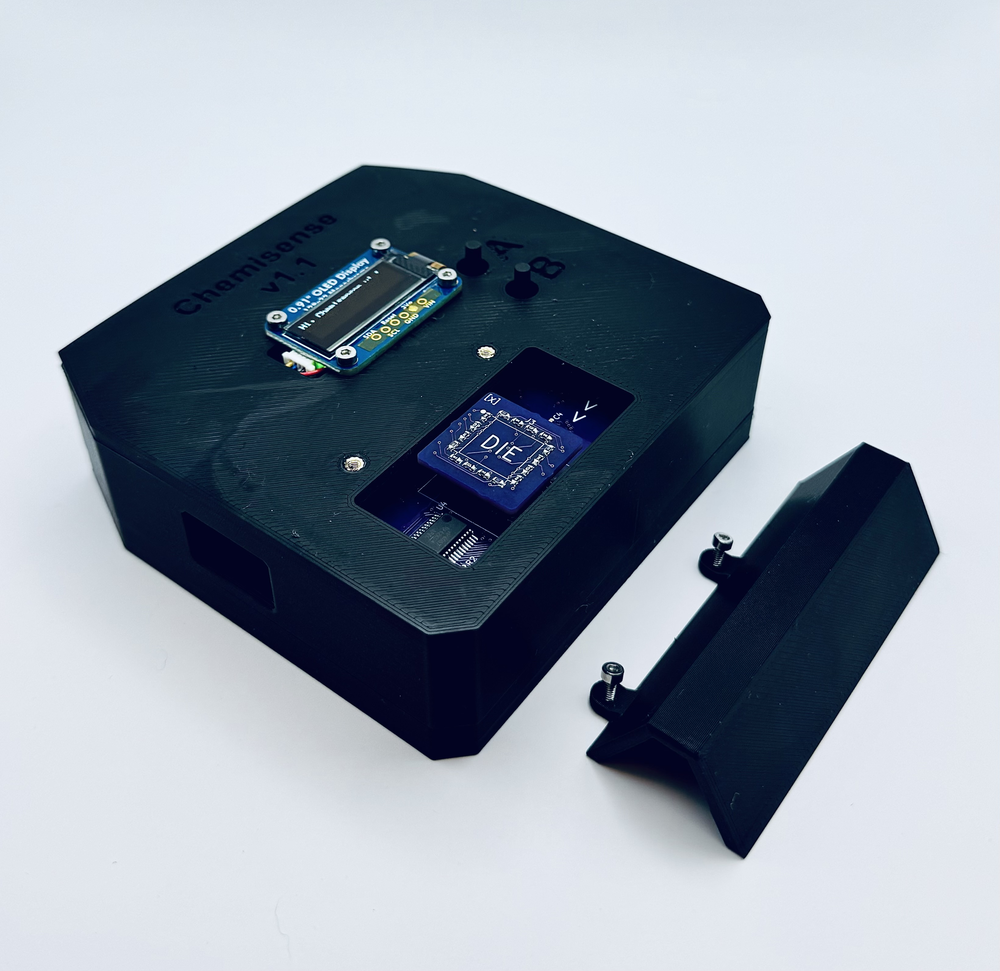

# Chemisense


Performs resistance measuring of 16 channels and ambient sensing with data logging via:
- [Arduino MKR WiFi 1010 (MCU)](https://store-usa.arduino.cc/products/arduino-mkr-wifi-1010)
- [TI ADS124S06 (ADC)](https://www.ti.com/product/ADS124S06)
- [TI CD74HC4067 (MUX)](https://www.ti.com/product/CD74HC4067)
- [TI INA190A](https://www.ti.com/product/INA190)
- [Bosch BME680 Gas Sensor](https://www.bosch-sensortec.com/products/environmental-sensors/gas-sensors/bme680/)
- [Adafruit 4682 Micro-SD Card Breakout](https://www.digikey.com/en/products/detail/adafruit-industries-llc/4682/12822319)

Schematic and PCB were designed using KiCad and are available by secure link.

## Quick Start
1. Power on the device (LED will pulse green when ready)
2. Connect via serial terminal at 9600 baud
3. Type `help` to see available commands
4. Try a single measurement: `sample 0,1,2`
5. Start continuous measurements: `init rate_limit=min;sample_average=10;channels=0,1,2;start`

## Detailed Usage
### Power-Up Sequence
When powered on, the LED will show:
- **Blue**: During initialization
- **Pulsing Green**: Ready for commands
- **Pulsing Red**: Error condition

The initialization sequence includes:
1. Serial port (USB)
2. IO configuration
3. ADC setup
4. MUX enabling
5. SD card check
6. Gas sensors setup

### Command Interface
The device accepts commands through the serial port (9600 baud). There are two types of sampling commands:

#### 1. Single Sample Commands
```
sample 0              # Sample only channel 0
sample 0,1,2         # Sample channels 0, 1, and 2
sample all           # Sample all channels (0-15)
```
- Takes one measurement using current averaging settings
- Returns results immediately
- Format: `CH:VALUE,CH:VALUE,...` (e.g., `0:123.45,1:234.56`)

#### 2. Continuous Sampling Commands
```
# Full configuration with immediate start:
init rate_limit=min;sample_average=10;channels=0,1,2;start

# Or configure and start separately:
init rate_limit=1;sample_average=10;channels=0,1,2
start

# Stop continuous sampling:
stop
```

Configuration Parameters:
- `rate_limit`: Time between measurements
  - `min`: As fast as possible
  - `1`: One second between measurements
  - `0.5`: Half second between measurements
  - etc.
- `sample_average`: Number of samples to average (1-255)
  - Higher values: More stable readings, slower updates
  - Lower values: Faster updates, more noise
- `channels`: Which channels to measure
  - Individual: `0,1,2`
  - All: `all`

#### 3. Utility Commands
```
show     # Display current values for all channels
log      # Save all channel values to SD card
help     # Show command help
```

### Output Formats
All measurements are output in the format:
```
CH:VALUE,CH:VALUE,...

Example:
0:123.4567,1:234.5678,2:345.6789
```
- CH: Channel number (0-15)
- VALUE: Resistance in ohms (4 decimal places)

### Data Logging
The `log` command saves data to the SD card:
- Files are numbered sequentially (00000.TXT, 00001.TXT, etc.)
- CSV format with "key,value" header
- Includes all channel measurements and gas sensor data
- Use [Neurotech-Hub/Chemisensor-MATLAB](https://github.com/Neurotech-Hub/Chemisensor-MATLAB) for data analysis

### Performance Notes
The device uses optimized timing for stability:
- MUX switching: 50ms
- ADC conversion: 15ms
- Current source: 85ms
- Round delay: 25ms
- Channel delay: 2ms

These timings balance measurement speed and accuracy. For best results:
1. Allow system to warm up for 3-5 minutes
2. Use `sample_average=3` or higher for stable readings (at the expense of longer sampling duration)

### Charging
**Important:** The power switch must be ON to charge the battery. This is due to the simple battery switch design utilizing the Arduino's charging module.

## Custom Dependencies
Required library (clone to Arduino/libraries):
- [Neurotech-Hub/ADS124S06-Arduino](https://github.com/Neurotech-Hub/ADS124S06-Arduino)

## Hardware Notes
- The I2C screen is modified with a 3.3V line for battery operation
- Measurement stability includes thermal and reference drift compensation